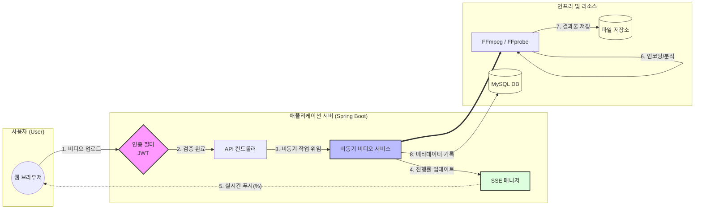

# 📺 스트리밍 서비스 프로젝트

사용자 맞춤형 동영상 스트리밍 및 채널 관리 플랫폼입니다. Spring Boot를 기반으로 고효율 비디오 인코딩(AV1)과 실시간 상태 알림(SSE), JWT 보안 인증을 결합하여 견고한 스트리밍 환경을 구축했습니다.

---

## 🚀 주요 기능

### 1. 비디오 프로세싱 및 실시간 스트리밍
* **AV1 코덱 인코딩:** FFmpeg를 활용하여 차세대 고효율 코덱인 AV1으로 영상을 자동 변환, 저용량 고화질 스트리밍을 지원합니다.
* **FFprobe 미디어 분석:** 업로드된 영상의 재생 시간, 해상도 등 메타데이터를 자동 추출하여 DB에 저장합니다.
* **실시간 인코딩 상태 알림:** **SSE(Server-Sent Events)**를 통해 백엔드에서 진행되는 영상 변환 과정을 클라이언트에게 실시간 진행률(%)로 전달합니다.

### 2. 채널 및 커뮤니티 관리
* **구독 시스템:** 채널 구독/취소 및 실시간 구독자 수 집계 기능을 제공합니다.
* **재생목록(Playlist):** 비디오를 그룹화하여 관리할 수 있는 나만의 재생목록 CRUD 기능을 구현했습니다.
* **댓글 및 대댓글:** 비디오별 계층형 댓글 시스템을 통해 사용자 간 인터랙션을 지원합니다.

### 3. 보안 및 인증 아키텍처
* **JWT 이중 토큰 인증:** Access Token과 Refresh Token을 사용하여 보안성과 사용자 편의성을 동시에 확보했습니다.
* **HttpOnly Cookie:** Refresh Token을 HttpOnly 쿠키에 저장하여 클라이언트 사이드 스크립트를 통한 토큰 탈취(XSS)를 방지합니다.

---

## 🛠 기술 스택

### Backend
- **Framework:** Spring Boot 3.3.2
- **Language:** Java 17
- **Database:** MySQL / Spring Data JPA
- **Security:** Spring Security, JWT (JSON Web Token)
- **Multimedia:** FFmpeg, FFprobe (Library: `net.bramp.ffmpeg`)
- **Communication:** SSE (Server-Sent Events)

---

## 🏗 서비스 아키텍처

본 프로젝트는 대용량 미디어 처리와 실시간 피드백을 위해 다음과 같은 비동기 이벤트 기반 구조로 설계되었습니다.




## 🏗 기술적 도전 과제 및 해결

### 1. Spring Boot 3.2+ 파라미터 바인딩 대응
* **Challenge:** 최신 Spring Boot 환경에서 `-parameters` 옵션 미적용 시 `@PathVariable`, `@RequestParam` 이름 매핑이 유실되는 이슈 발생.
* **Solution:** 모든 컨트롤러의 어노테이션에 명시적으로 변수명을 지정(`@PathVariable("id")`)하여 환경에 구애받지 않는 런타임 안정성을 확보했습니다.

### 2. 비동기 멀티미디어 파이프라인 구축
* **Challenge:** 고해상도 영상의 AV1 인코딩은 긴 시간이 소요되어 HTTP 연결 타임아웃 위험이 있음.
* **Solution:** 인코딩 로직을 별도 스레드로 분리하고, **SSE** 세션을 관리하여 사용자에게 실시간 피드백을 제공함으로써 서비스 이탈률을 낮췄습니다.

### 3. 리소스 관리 최적화
* **Challenge:** 다수의 SSE 연결 시 메모리 누수 및 스레드 경합 가능성.
* **Solution:** `ConcurrentHashMap`을 사용하여 스레드 안전성을 확보하고, `onCompletion`/`onTimeout` 콜백을 통해 종료된 연결을 즉시 제거하여 리소스를 최적화했습니다.

---

## 📂 프로젝트 구조

```text
src/main/java/com/sewoong/streaming/
├── controller/     # API Endpoints (Video, Member, Subscribe, Playlist, SSE)
├── service/        # Business Logic (File Upload, Encoding, Business Rules)
├── repository/     # Persistence Layer (Spring Data JPA)
├── dto/            # Data Transfer Objects
├── domain/         # Entities & Domain Models
└── security/       # JWT Provider & Security Configuration
